# Smart Government – AI Agentic Hackathon


## 🧪 Deel 2 Agent lab

We gaan nu aan de slag met Agents. Agents zijn Large Language Models (LLM’s) die in een continue loop draaien tot dat een specifiek doel bereikt, de instructies, bereikt is. In die loop combineren ze redeneren met toegang tot context, zoals RAG-oplossingen, knowledge databases en kunnen ze acties uitvoeren doormiddel van tools om het doel te bereiken.

Belangrijk om te begrijpen is dat LLM’s getraind zijn op publieke data en niet op data binnen jouw organisatie. Een LLM wordt pas echt waardevol wanneer deze wordt verrijkt met jouw specifieke context, data en processen.

Moderne LLM’s zijn daarnaast getraind om niet alleen antwoorden te genereren, maar ook om acties uit te voeren via tools. Hiervoor zien we dat MCP (Model Context Protocol) zich snel ontwikkelt tot een standaard, al bestaan er meerdere architecturen en implementatie-opties.

Agents kunnen op verschillende manieren worden ingezet. Vaak zien we ze terug in een chatachtige omgeving, waar een gebruiker in natuurlijke taalvragen stelt en acties start. Daarnaast kunnen agents onderdeel zijn van workflows, waarbij meerdere gespecialiseerde agents samenwerken, ieder met een eigen rol, zoals analyseren, plannen, beslissen en uitvoeren.

Op deze manier ontstaan flexibele, modulaire oplossingen waarin agents zelfstandig taken afhandelen, elkaar aansturen en waar nodig de gebruiker betrekken.

In dit document doorloop je stap voor stap hoe je inlogt op Azure AI Foundry, een project selecteert en een eerste agent aanmaakt (inclusief het koppelen van tools zoals Fabric Data Agent en Foundry IQ).

Inhoud van de Agent Labs


- Lab 1: Inloggen en verkennen van Microsoft Foundry
- Lab 2: Configureer en gebruik de Fabric Data Agent in Microsoft Foundry
- Lab 3: Maken van aanvragen agent met gebruik Foundry IQ en MCP


## 🧪 Lab 1: Inloggen en verkennen van Microsoft Foundry

Om van start te gaan zullen we eerst inloggen in de Microsoft Foundry omgeving en een aantal zaken opzetten om aan de slag te gaan met Data Agents.

Voordat we verder gaan


- Na de introductie heb je tijdelijke login gegevens (gebruikersnaam en wachtwoord) gekregen. Mocht dat niet het geval zijn, laat dat weten aan de instructeurs.
- Download alvast deze instructies die beschikbaar zijn in de GitHub repository.

Aan de slag met Foundry


### We zullen nu de volgende acties uitvoeren:


- Inloggen bij Microsoft Foundryc met de tijdelijke login gegevens.
- Verkennen van de Agent omgeving.


### 👣 Stap 1: Log in bij Microsoft Foundry


- Ga naar [https://ai.azure.com](https://ai.azure.com)
- Voer de username email
- Voer het ontvangen wachtwoord (TAP) in en druk  Sign in


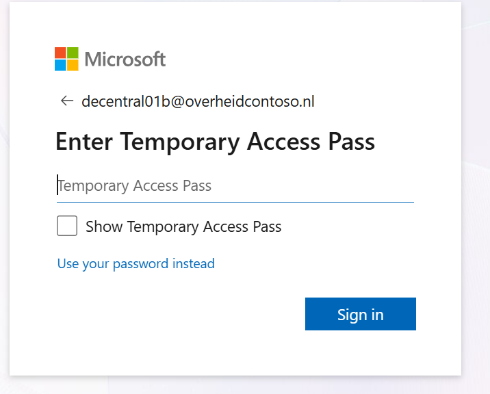


- Zodra je bent ingelogd kom je op de Foundry startpagina. Je start op de oude portal, vandaag gaan we gebruik maken van de nieuwe portal. Via de nieuwe portal is de verbeterde functionaliteit beschikbaar.
- Kies in het menu voor de nieuwe portal (New portal).


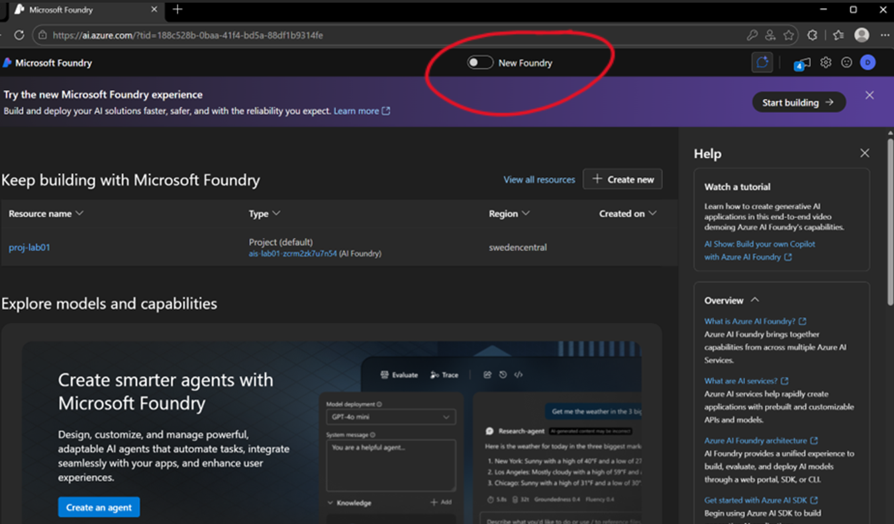


- Selecteer het project: proj-labxx.


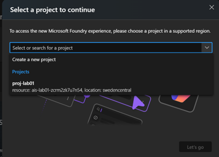


## Korte uitleg: Microsoft Foundry

Microsoft Foundry is de omgeving waarin je AI-oplossingen ontwikkelt en beheert. Het startpunt is een Foundry-resource: de centrale plek waar toegang, modellen en herbruikbare agents samenkomen.


- Projecten: maak binnen één Foundry resource één of meerdere projecten aan om use cases (of teams/omgevingen) te scheiden. Zo blijven instellingen, assets en rechten overzichtelijk.
- Agents: binnen een project maak je agents voor verschillende use cases (bijv. Q&A, samenvatten of proces-/workflow-automatisering). Agents gebruiken de modellen en tools die voor jouw project beschikbaar zijn.
- Modellen: op de Foundry resource staan modellen die gedeployed zijn of door iemand met de admin-rol beschikbaar zijn gemaakt. In je project/agent kies je vervolgens het model dat je mag en wilt gebruiken.
- Tools: je kunt tools gebruiken die al (deels) vooraf geconfigureerd zijn, zoals data-bronnen, search/retrieval, connectors of andere capabilities. Daarmee kun je sneller starten zonder alles zelf in te richten.

Kort samengevat: de Foundry-resource biedt de basis (toegang, modellen en gedeelde tools). Binnen projecten bouw je agents voor specifieke use-cases.


### 👣 Stap 2: Foundry verkennen


- Kies Build en verken de verschillende onderdelen van de omgeving.

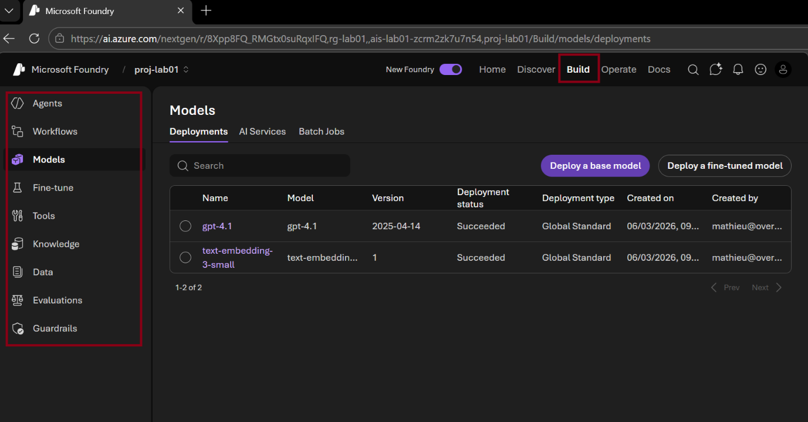


**Einde van Lab 1**

Hiermee sluiten we Lab 1 af en gaan we verder naar Lab 2 om een Data Agent te koppelen in Microsoft Foundry


## 🧪 Lab 2: Configureer en gebruik de Fabric Data Agent in Microsoft Foundry

In dit lab zullen we een gemaakte Fabric Data Agent koppelen en gebruiken in een Foundry Agent.

Voordat we verder gaan


- Zorg ervoor dat je de Fabric Labs hebt afgerond: Optioneel heb je toegang tot de workspace <xxxxxx> met een data agent.


### 👣 Stap 1: Maak een Foundry Agent aan


- Ga naar Agents en kies Create agent.


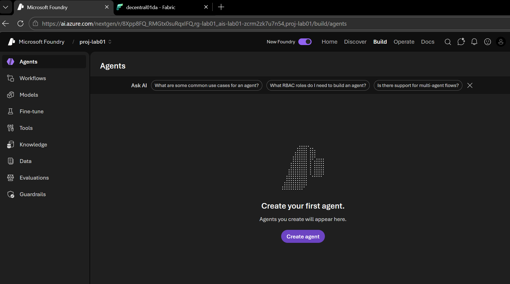


- Geef de agent een naam

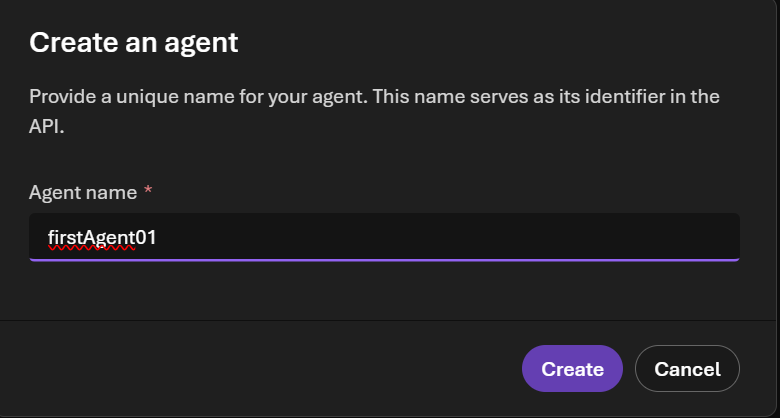

- Vul een eerste set instructions (prompt) in.
  - Voorbeeld-instructions:
  
```
  Rol: 
  Je bent een betrouwbare en nauwkeurige data-assistent die vragen beantwoordt op basis van historische aanvraagdata.Context:Je werkt uitsluitend met de beschikbare historische aanvraagdata.
  Doel: Je helpt gebruikers inzicht te krijgen in historische aanvragen door inhoudelijke vragen te beantwoorden, patronen te herkennen en trends in de data samen te vatten.
```

- Kies daarna Save en ga onder Tools naar Add.


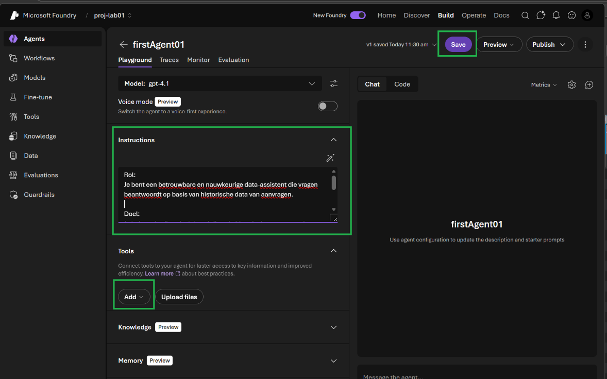


- Selecteer Browse All Tools

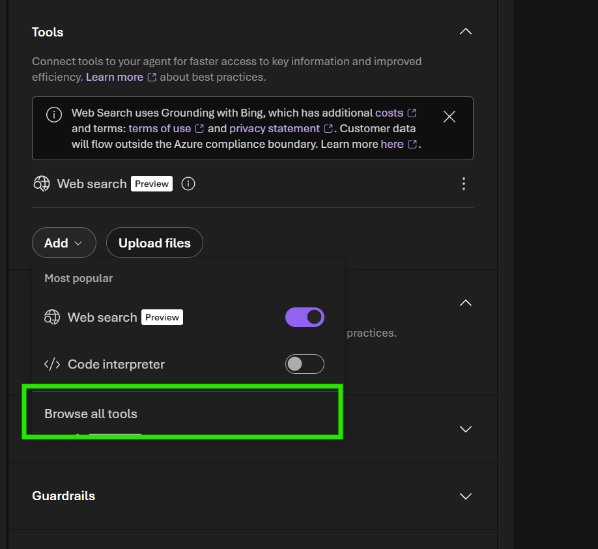


- Selecteer onder Tools de tool Fabric Data Agent.


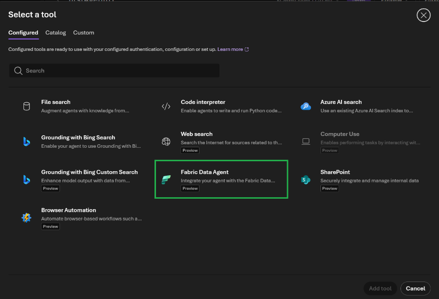


- Vul vervolgens de Workspace ID en Artifact ID in. Die je vindt op de volgende manier


- Ga in Fabric naar de agent die je hebt gemaakt. Kopieer uit de URL de Workspace ID en de Artifact ID.

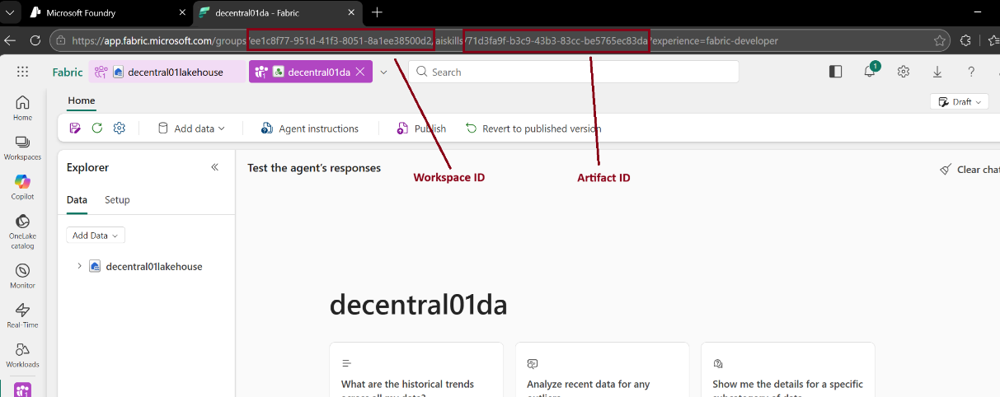


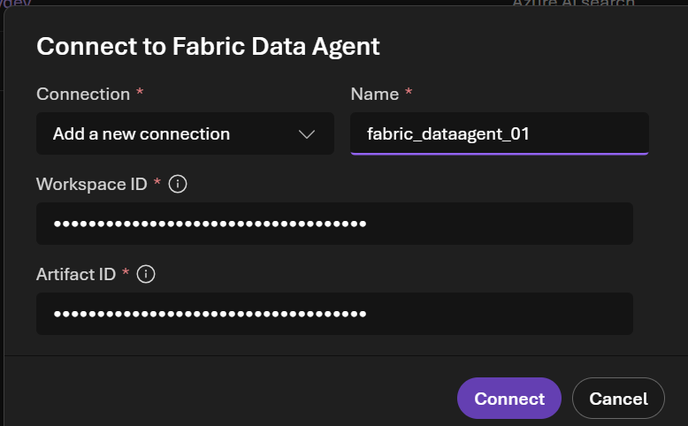

- Je kunt de agent nu testen in de chat.

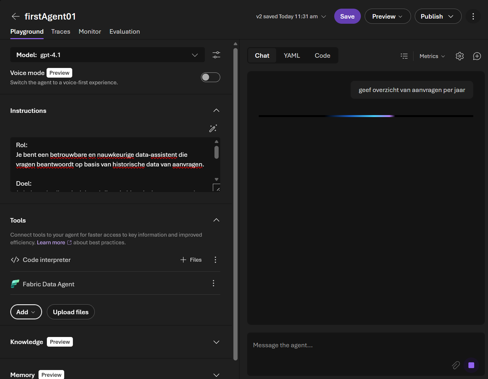

- “Type in de chat: Geef overzicht van aanvragen per jaar ?”

- Tip: voeg eventueel Code interpreter toe als tool en vraag de agent om bijvoorbeeld een grafiek per jaar te maken.

**Einde van Lab 2**


## 🧪 Lab 3: Aanvragen-agent maken (met Knowledge + aanvraag-tool)

In de omgeving zijn al twee tools/databronnen gekoppeld.

We maken nu met behulp van deze tools een aanvragen-agent.


### 👣 Stap 1: Create de aanvragen agent met knowledge


- Create a new agent

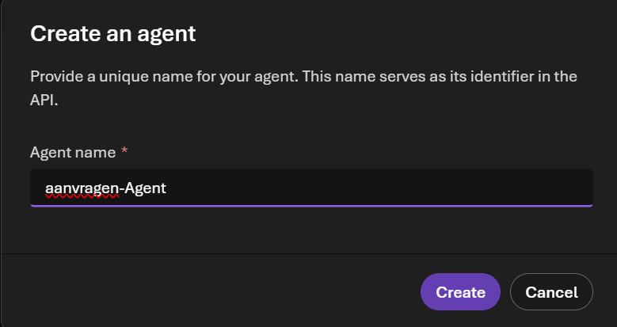


- Gebruik de volgende eenvoudige instructions (prompt):

``` 
  - Rol: 
  Je bent een digitale aanvragen-agent voor een gemeente. Je ondersteunt inwoners en medewerkers bij het begrijpen, volgen en afhandelen van verschillende soorten aanvragen.

  - Doel: 
  Je beantwoordt vragen over gemeentelijke aanvragen en ondersteunt het aanvraagproces door:
    - Informatie te geven op basis van gekoppelde knowledge bases.
    - De juiste aanvraag te herkennen en te starten via de aanvraag-tool.
    - De status en voortgang van bestaande aanvragen toe te lichten.
    - Als je bronnen gebruikt, voeg dan bronverwijzingen toe.
    - Voor nieuwe aanvragen/meldingen: controleer relevant beleid en help bij het verzamelen van de benodigde informatie.
    - Beantwoord de vragen als inwoner met BSN 101177006
``` 

- Verwijder de Web search-tool. Ga daarna naar Knowledge.

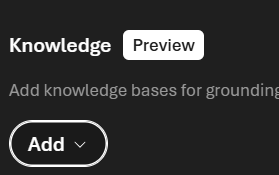

- Selecteer vervolgens Foundry IQ.

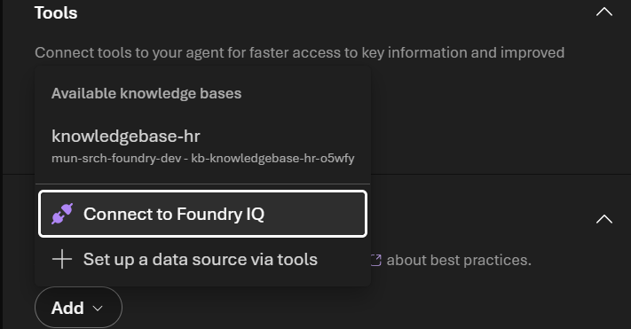

- Selecteer de knowledge base: vergunning-beleid-knowledgebase.

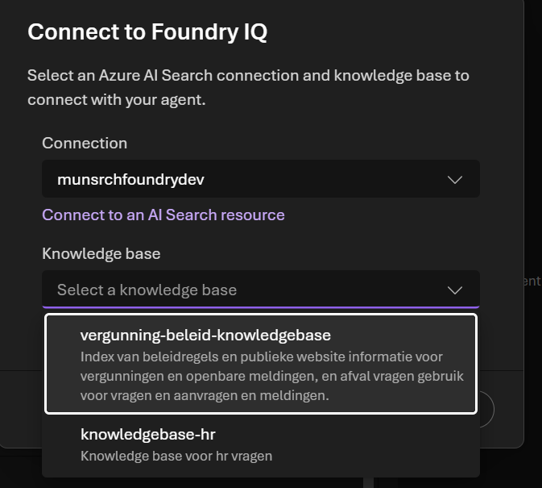

- Als de knowledge-datasource is gekoppeld, kun je vragen stellen. Omdat dit als tool is gekoppeld, vraagt Foundry eerst toestemming om de tool te gebruiken.Voorbeeldvragen: “Wat is het parkeerbeleid in zone A?” en “Ik wil een koelkast weggooien: wat moet ik doen?”

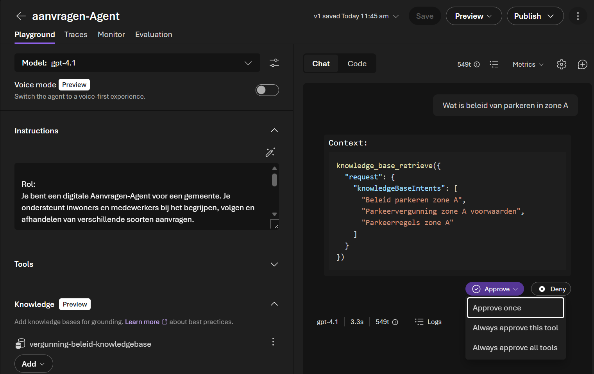


## Wat is Foundry IQ?

Foundry IQ is een agentic RAG-oplossing (Retrieval-Augmented Generation). Foundry IQ is bedoeld voor unstructured data, denk aan documenten met beleid, processen en gebruikers informatie. Hiermee kan een agent informatie ophalen uit meerdere gekoppelde bronnen en die context gebruiken om een antwoord te genereren. Foundry IQ vormt in de praktijk een koppeling vanuit Foundry naar Azure AI Search en knowledge bases.

In plaats van één losse knowledge base kun je in Azure AI Search meerdere bronnen aansluiten (bijvoorbeeld documenten/SharePoint, databronnen of andere repositories). De agent zoekt vervolgens gericht in deze bronnen via een taalmodel. Het taalmodel selecteert relevante passages en combineert die tot een volledig en consistent antwoord (waar mogelijk herleidbaar naar de gebruikte bronnen).

De knowledge base vergunning-beleid-knowledgebase bestaat uit de volgende bronnen:


- Afvalinformatie (gescrapet van het web), inclusief vergunning informatie van een gemeente website.
- Een door Fabric geïndexeerde databron met Contoso-beleidsregels.


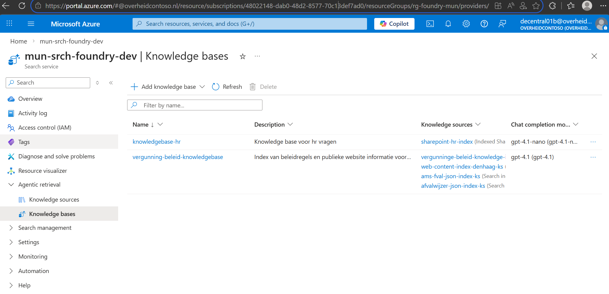

Om dit knowledgebases mogelijk te maken binnen Microsoft Foundry heb jeals AI User  leesrechten en de rol Index Reader gekregen. In de Azure-portal kun je de knowledge bases ook bekijken via onderstaande link.

[https://portal.azure.com/#@overheidcontoso.nl/resource/subscriptions/48022148-dab0-48d2-8577-70c13def7ad0/resourceGroups/rg-foundry-mun/providers/Microsoft.Search/searchServices/mun-srch-foundry-dev/knowledgeBases](https://portal.azure.com/)


## 👣 Stap 2: Tools gebruiken. Aanvragen -MCP


- Kies Save om je wijzigingen op te slaan.
- Daarna gebruiken we via Tools een vooraf geconfigureerde tool.

Ga naar Tools en selecteer aanvragen-mcp.


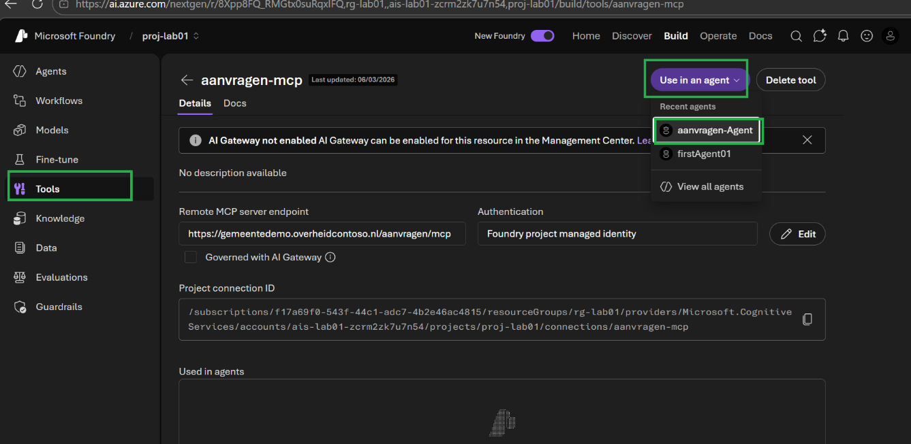


- Stel nu een vraag over openstaande aanvragen: Welke aanvragen heb ik open staan?


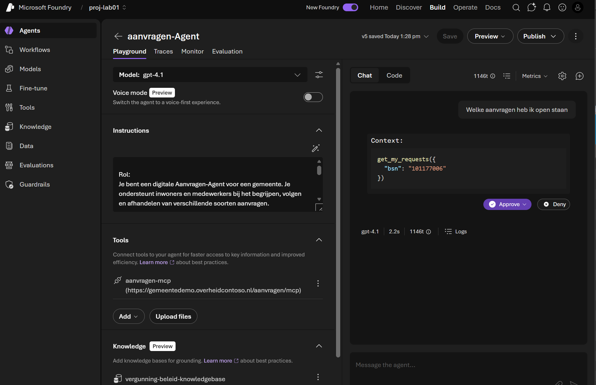

Probeer ook eens een melding (bijvoorbeeld iets dat defect is) of vraag via de agent een parkeervergunning aan.


- Bekijk ook ook traces en monitor en enable continu evauaties op groundedness en Intent.

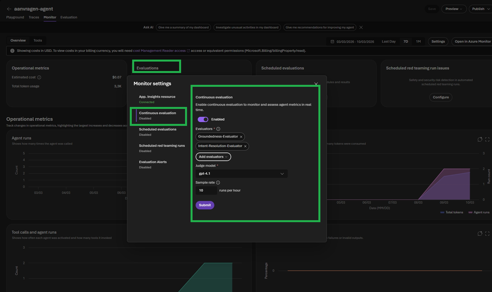


**Einde van Lab 3**

Dit was het laatste lab en hiermee sluiten we de Agent Lab af.

Laat vooral weten of je nog vragen hebt. Mocht je al snel klaar zijn, voel je vrij om er verder mee te experimenteren door andere en complexere vragen te stellen.


### [Terug naar readme](./README.md)