# Smart Government – AI Agentic Hackathon

## 🏭 Deel 1 Data Agents in Fabric

We gaan als eerste aan de slag met Microsoft Fabric Agents. Data Agents in Microsoft Fabric zijn slimme digitale assistenten die je helpen om makkelijker met data te werken. Je kunt ze zien als een laag tussen jou en de data: in plaats van zelf complexe queries te schrijven of precies te weten waar data staat, kun je een Data Agent vragen stellen in gewone taal. Hierdoor kunnen zowel technische als niet-technische gebruikers sneller inzichten krijgen uit data.

In dit document doorloop je stap voor stap hoe je inlogt op Microsoft Fabric, een Lakehouse aanmaakt, shortcuts aanmaakt naar een ander Lakehouse en hoe je deze data kunt gebruiken met Data Agents In Microsoft Fabric.

Deze hackathon is bedoeld voor developers, solution architects, data engineers, AIspecialisten en innovators binnen de gemeentes en andere overheidsorganisaties.

Inhoud van de Labs

- Lab 1: Opzetten van de omgeving
- Lab 2: Configureer een Data Agent
- Lab 3: Aan de slag met Data Agents

## 🧪 Lab 1: Opzetten van de omgeving

Om van start te gaan zullen we eerst inloggen in de Fabric omgeving en een aantal zaken opzetten om aan de slag te gaan met Data Agents.

Voordat we verder gaan

- Na de introductie heb je tijdelijke login gegevens (gebruikersnaam en wachtwoord) gekregen. Mocht dat niet het geval zijn, laat dat weten aan de instructeurs.
- Download alvast de PDF-bestanden die beschikbaar zijn in de GitHub repository.

Aan de slag met Fabric

### We zullen nu de volgende acties uitvoeren:

- Inloggen bij Microsoft Fabric met de tijdelijke login gegevens.
- Verifiëren dat we toegang hebben tot de workspace.
- Een shortcut aanmaken naar de data die we gaan gebruiken.

### 👣 Stap 1: Log in bij Microsoft Fabric

- Ga naar [https://app.fabric.microsoft.com](https://app.fabric.microsoft.com)

- Voer de username in en druk op submit:

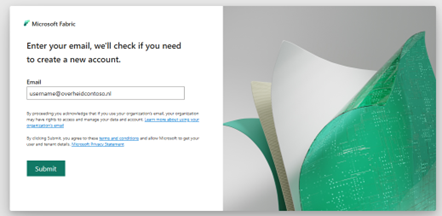

- Voer het ontvangen wachtwoord (TAP) in en druk  Sign in

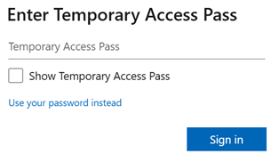

- Zodra je bent ingelogd kom je op de Fabric startpagina. Vanaf deze pagina zullen we navigeren naar je Workspace. De naam van je workspace is gelijk aan de gebruikte username, bijvoorbeeld Decentral01.

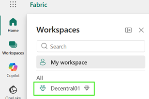

### 👣 Stap 2: Lakehouse aanmaken

- Maak nu binnen je workspace een Lakehouse aan via New item.

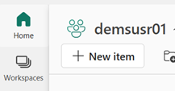

- Zoek naar Lakehouse in het geopende venster

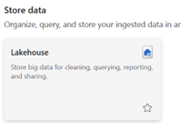

- Maak een Lakehouse aan met een eenvoudige naam zoals GebruikersnaamLakehouse

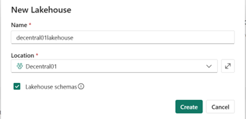

### 👣 Stap 3: Maak een shortcut aan

Voor de Data Agent zullen we data gebruiken uit een gedeelde Workspace. Om deze data te benaderen vanuit je eigen Workspace maken we gebruik van Shortcuts. Deze shortcuts maken we aan vanuit het Lakehouse.

- Navigeer naar het zojuist aangemaakte Lakehouse:

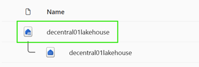

- Maak binnen het schema dbo onder Tables een shortcut aan.

- De tabellen die we gaan gebruiken bevinden zich in een ander Lakehouse. Selecteer Microsoft OneLake.

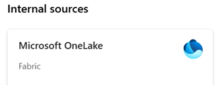

- Selecteer het volgende Lakehouse.

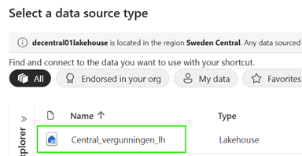

- Selecteer de volgende twee tabellen.

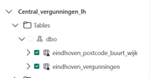

- Controleer of het klopt en druk op Create

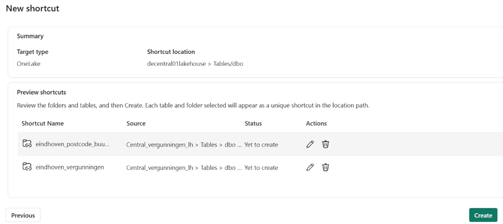

- Controleer of de tabellen zijn toegevoegd.

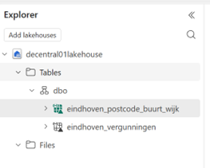

- Ga terug naar de Workspace door op de Workspace naam te klikken.

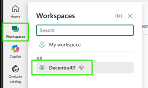

**Einde van Lab 1**

Hiermee sluiten we Lab 1 af en gaan we verder naar Lab 2 om een Data Agent aan te maken!

## 🧪 Lab 2: Configureer een Data Agent

In dit lab zullen we een eerste Data Agent aanmaken en deze testen op de data in ons Lakehouse.

Voordat we verder gaan

- Zorg ervoor dat je Lab 1: Opzetten van de omgeving hebt afgerond.

Aanmaken van een Data Agent

### We zullen nu de volgende acties uitvoeren:

- Aanmaken van een Data Agent
- De Data Agent verbinden met data in het Lakehouse
- Vragen stellen aan de Data Agent

### 👣 Stap 1: Maak een Data Agent aan

- Maak vanuit de Workspace een New Item aan

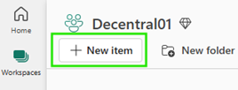

- Zoek naar een Data Agent en selecteer Data Agent (Preview)

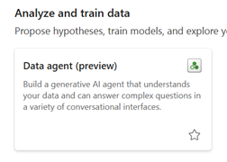

- Geef de Data Agent een naam en maak deze aan met Create.

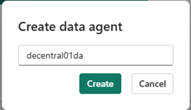

- Zodra de Data Agent is aangemaakt zullen we de data uit het Lakehouse toewijzen. Onder No data added druk op Add Data.

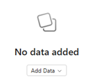

- Gebruik hier het eigen lakehouse en selecteer Add

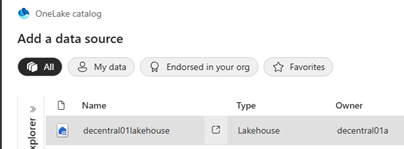

- Je ziet nu de Lakehouse toegevoegd aan de Data Agent, vervolgens selecteren we de tabel eindhoven_vergunningen:

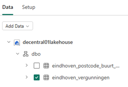

- Laten we nu proberen of de Data Agent inderdaad ook vragen kan beantwoorden op de data. Stel de volgende simpele vraag: Hoeveel vergunningen zitten er in de vergunningen tabel?

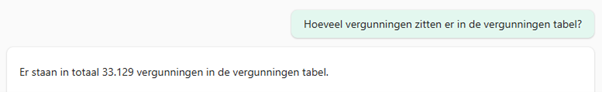

Einde van Lab 2

Hiermee sluiten we Lab 2 af en gaan we verder naar Lab 3 om de vergunningen-data verder te verkennen!

## 🧪 Lab 3: Aan de slag met Data Agents

Voordat we verder gaan

- Zorg ervoor dat je Lab 1 en 2 hebt afgerond.

Werken met Data Agents

### We zullen nu de volgende acties uitvoeren:

- Data verkennen met een Data Agent
- Resultaten verbeteren met Agent Instructions
- Resultaten verbeteren met Few Shots Queries
- Resultaten verbeteren met Datasource Instructions

### 👣 Stap 1: Data verkennen met een Data Agent

- Stel de volgende vraag aan de Data Agent: Geef me 10 willekeurige rijen uit de data set

- De output van deze vraag opgebouwd uit een aantal onderdelen:
  - Een uitgeschreven reactie, in dit geval krijgen we een lijst terug met adressen, aantallen en wat extra informatie.

  - Als we iets verder inzoomen zien we dat de Data Agent 1 stap gebruikt heeft (1 step completed). Als we deze uitklappen kunnen we ook de SQL-query en output van de query bekijken.

- Vraag nu zelf wat vragen over de de vergunningendata. Neem ook de tijd om te zien wat de Data Agent heeft gedaan om de data op te halen. Een aantal voorbeeldvragen om je op weg te helpen:

### 👣 Stap 2: Resultaten verbeteren met Agent Instructions

- We beginnen met het opschonen van het huidige chat venster. Druk daarvoor op Clear Chat in de rechterbovenhoek.

- Selecteer Agent Instructions in the menu-bar

- Voeg de volgende instructie toe aan de agent: “Zodra er resultaten worden getoond, maak altijd gebruik van een tabel in Markdown-formaat voor data die in tabelvorm moet worden weergeven.”

- Stel nu de vragen aan de agent en bekijk het resultaat. Hoe worden de gegevens nu weergegeven?

### 👣 Stap 3: Resultaten verbeteren met Few Shots Queries

- Data Agent gebruikt de chat geschiedenis als onderdeel van de context. We beginnen daarom met het opschonen van het huidige chat-window. Druk daarvoor op Clear Chat in de rechterbovenhoek.

- Vraag aan de Data Agent het volgende: Geef een top 5 van de straten met de meeste vergunningsaanvragen?

De straatnamen zijn afgebroken na het eerste woord, dat klopt dus helaas bepaalde gevallen niet.

- Om dit te verbeteren kunnen we twee dingen doen:
  - De agent vragen om de logica in de SQL Query te optimaliseren; gebruik de tekst tot aan het eerste getal dat je tegenkomt.
  - Gebruik maken van een postcodetabel met daarin gestructureerde adresgegevens waaronder de straatnaam, regio.

- In dit geval gaan we gebruik maken van een officiële postcodetabel en geven we de Data Agent een voorbeeld hoe deze gebruikt kan worden.
  - Voeg eerst tabel eindhoven_postcode_buurt_wijk toe

  - Ga vervolgens naar Example Queries

- Klik op Add example

- Voeg de volgen combinatie van vraag en query toe:
  - Question: Geef een top 5 van de straten met de meeste vergunningsaanvragen?
  - Query:

  - Sluit het configuratie-tabblad

- We beginnen met een nieuwe chat, druk daarom weer op Clear Chat
- Vraag de Data Agent het volgende:
  - Welke straat heeft de meeste vergunningsaanvragen?

  - Geef een top 5 van de straten met de meeste vergunningsaanvragen?

Je zult nu zien dat de Data Agent gebruik maakt van de postcodetabel.

Note: Valt er ook iets op aan de resultaten? Mocht je tijd over hebben, voel je vrij om eens op onderzoek te gaan doormiddel van het Lakehouse SQL Endpoint.

### 👣 Stap 4: Resultaten verbeteren met Datasource Instructions

- Data Agent gebruikt de chat geschiedenis als onderdeel van de context. We beginnen daarom met het opschonen van het huidige chat-window. Druk daarvoor op Clear Chat in de rechterbovenhoek.

- Vraag de Data Agent: Geef me alle open aanvragen ouder dan 30 dagen. Sorteer deze op de oudste eerst.

Als we kijken naar de gebruikte query, dan zullen we zien dat de agent Status = ‘Open’ gebruikt. Dat is niet juist en de Data Agent heeft dus meer context nodig.

- Om de Data Agent te helpen dit correct te bepalen geven we een extra instructie mee. Ga naar de Data Source Instructions

- Voeg de volgende instructies toe onder Data source instructions:

- We beginnen met een nieuwe chat, druk daarom weer op Clear Chat

- Stel de vraag opnieuw: Geef me alle open aanvragen ouder dan 30 dagen. Sorteer deze op de oudste eerst.

Om het volgende hackathon onderdeel succesvol te vervolgen, gaan we eerst de aangemaakte Data Agent publiceren.

- Selecteer Publish

- Geef een korte beschrijving en druk op Publish

***Einde van Lab 3***

Dit was het laatste lab en hiermee sluiten we deel 1 van de hackathon af.

Laat vooral weten of je nog vragen hebt. Mocht je al snel klaar zijn, voel je vrij om verder te experimenteren door andere en complexere vragen te stellen.

### [Terug naar readme](./README.md)