# Smart Government – AI Agentic Hackathon

## 🏭 Part 1 Data Agents in Fabric

We'll start by working with Microsoft Fabric Agents. Data Agents in Microsoft Fabric are smart digital assistants that help you work with data more easily. You can see them as a layer between you and the data: instead of writing complex queries yourself or knowing exactly where data is stored, you can ask a Data Agent questions in plain language. This allows both technical and non-technical users to get insights from data faster.

In this document you will walk through step by step how to log in to Microsoft Fabric, create a Lakehouse, create shortcuts to another Lakehouse and how you can use this data with Data Agents In Microsoft Fabric.

This hackathon is intended for developers, solution architects, data engineers, AI specialists and innovators within municipalities and government organizations.

Content of the Labs

- Lab 1: Setting up the environment
- Lab 2: Configure a Data Agent
- Lab 3: Getting started with Data Agents

## 🧪 Lab 1: Setting up the environment

To get started, we will first log in to the Fabric environment and set up a number of things to get started with Data Agents.

Before we continue

- After the introduction you received temporary login details (username and password). If not, let the instructors know.
- Download the PDF files available in the GitHub repository.

Getting started with Fabric

### We will now perform the following actions:

- Log in to Microsoft Fabric with the temporary login details.
- Verify that we have access to the workspace.
- Create a shortcut to the data we are going to use.

### 👣 Step 1: Log in to Microsoft Fabric

- Go to [https://app.fabric.microsoft.com](https://app.fabric.microsoft.com)

- Enter the username and press submit:

- Enter the received password (TAP) and press Sign in

- Once logged in, you will arrive at the Fabric home page. From this page we will navigate to your Workspace. The name of your workspace is equal to the username used, for example Decentral01.

### 👣 Step 2: Create Lakehouse

- Now create a Lakehouse within your workspace via New item.

- Search for Lakehouse in the opened window

- Create a Lakehouse with a simple name like UsernameLakehouse

### 👣 Step 3: Create a shortcut

For the Data Agent we will use data from a shared Workspace. To access this data from your own Workspace we use Shortcuts. We create these shortcuts from the Lakehouse.

- Navigate to the newly created Lakehouse:

- Create a shortcut within the schema dbo under Tables.

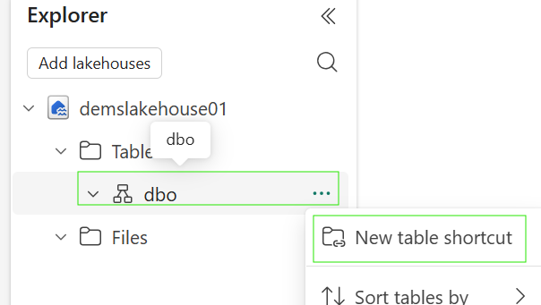

- The tables we are going to use are in another Lakehouse. Select Microsoft OneLake.

- Select the following Lakehouse.

- Select the following two tables.

- Check if it is correct and press Create

- Check if the tables have been added.

- Go back to the Workspace by clicking on the Workspace name.

**End of Lab 1**

This concludes Lab 1 and we move on to Lab 2 to create a Data Agent!

## 🧪 Lab 2: Configure a Data Agent

In this lab we will create a first Data Agent and test it on the data in our Lakehouse.

Before we continue

- Make sure you have completed Lab 1: Setting up the environment.

Creating a Data Agent

### We will now perform the following actions:

- Creating a Data Agent
- Connecting the Data Agent to data in the Lakehouse
- Asking questions to the Data Agent

### 👣 Step 1: Create a Data Agent

- Create a New Item from the Workspace

- Search for a Data Agent and select Data Agent (Preview)

- Give the Data Agent a name and create it with Create.

- Once the Data Agent is created we will assign the data from the Lakehouse. Under No data added press Add Data.

- Use your own lakehouse here and select Add

- You will now see the Lakehouse added to the Data Agent, next we select the table eindhoven_vergunningen:

- Let's try now if the Data Agent can indeed answer questions about the data. Ask the following simple question: How many permits are there in the permits table?

End of Lab 2

This concludes Lab 2 and we move on to Lab 3 to further explore the permit data!

## 🧪 Lab 3: Getting started with Data Agents

Before we continue

- Make sure you have completed Lab 1 and 2.

Working with Data Agents

### We will now perform the following actions:

- Exploring data with a Data Agent
- Improving results with Agent Instructions
- Improving results with Few Shots Queries
- Improving results with Datasource Instructions

### 👣 Step 1: Explore data with a Data Agent

- Ask the Data Agent the following question: Give me 10 random rows from the data set

- The output of this question consists of a number of parts:
  - A written response, in this case we get a list of addresses, numbers and some extra information.

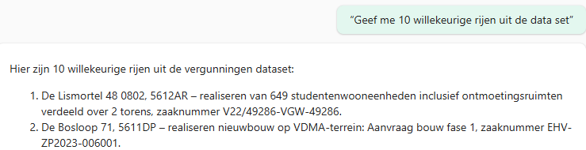

  - If we zoom in a bit further we see that the Data Agent used 1 step (1 step completed). If we expand this we can also view the SQL query and output of the query.

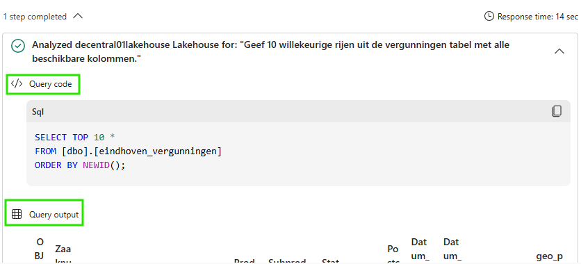

- Now ask some questions yourself about the permit data. Also take the time to see what the Data Agent did to retrieve the data. A number of example questions to help you on your way:

### 👣 Step 2: Improving results with Agent Instructions

- We start by cleaning up the current chat window. Press Clear Chat in the top right corner.

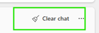

- Select Agent Instructions in the menu-bar

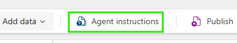

- Add the following instruction to the agent: “As soon as results are shown, always use a table in Markdown format for data that must be displayed in table form.”

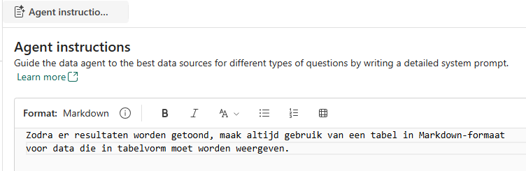

- Now ask the questions to the agent and view the result. How are the data displayed now?

### 👣 Step 3: Improving results with Few Shots Queries

- Data Agent uses the chat history as part of the context. We therefore start by cleaning up the current chat-window. Press Clear Chat in the top right corner.

- Ask the Data Agent the following: Give a top 5 of the streets with the most permit applications?

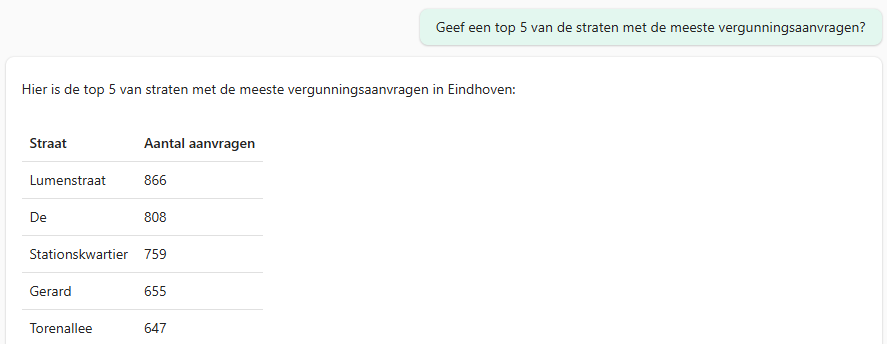

The street names are cut off after the first word, so that is unfortunately incorrect in certain cases.

- To improve this we can do two things:
  - Ask the agent to optimize the logic in the SQL Query; use the text up to the first number you encounter.
  - Make use of a postcode table containing structured address details including street name, region.

- In this case we are going to use an official postcode table and give the Data Agent an example how it can be used.
  - First add table eindhoven_postcode_buurt_wijk

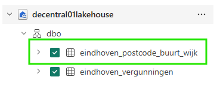

  - Then go to Example Queries

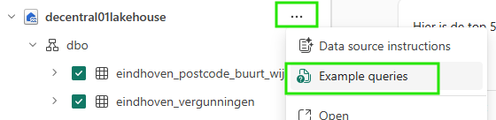

- Click on Add example

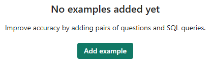

- Add the following combination of question and query:
  - Question: Give a top 5 of the streets with the most permit applications?
  - Query:

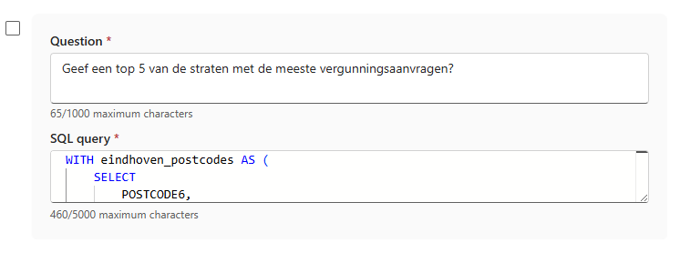

  - Close the configuration tab

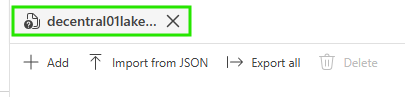

- We start with a new chat, so press Clear Chat again
- Ask the Data Agent the following:
  - Which street has the most permit applications?

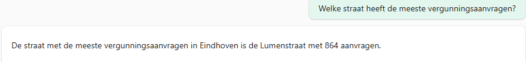

  - Give a top 5 of the streets with the most permit applications?

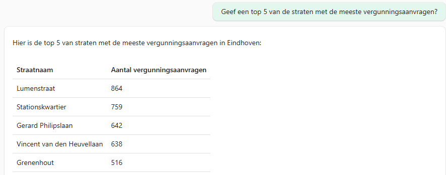

You will now see that the Data Agent makes use of the postcode table.

Note: Do you notice anything else about the results? If you have time left, feel free to investigate using the Lakehouse SQL Endpoint.

### 👣 Step 4: Improving results with Datasource Instructions

- Data Agent uses the chat history as part of the context. We therefore start by cleaning up the current chat-window. Press Clear Chat in the top right corner.

- Ask the Data Agent: Give me all open applications older than 30 days. Sort these by the oldest first.

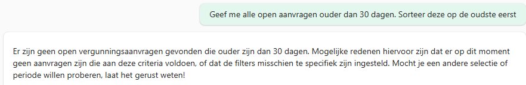

If we look at the query used, we will see that the agent uses Status = ‘Open’. That is not correct and the Data Agent therefore needs more context.

- To help the Data Agent determine this correctly, we give an extra instruction. Go to the Data Source Instructions

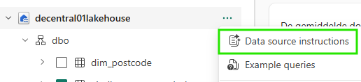

- Add the following instructions under Data source instructions:

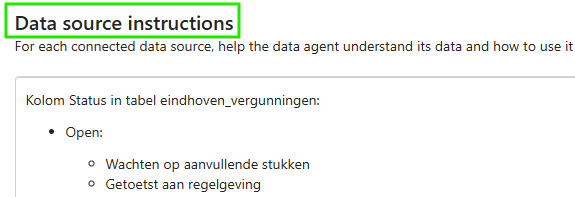

- We start with a new chat, so press Clear Chat again

- Ask the question again: Give me all open applications older than 30 days. Sort these by the oldest first.

To successfully continue the next hackathon part, we first publish the created Data Agent.

- Select Publish

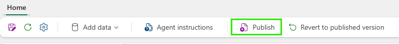

- Give a short description and press Publish

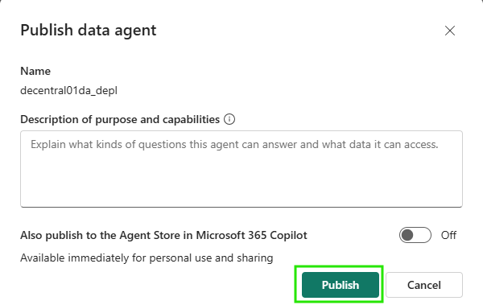

***End of Lab 3***

This was the last lab and with this we close part 1 of the hackathon.

Please let us know if you have any questions. If you finish quickly, feel free to experiment further by asking other and more complex questions.

### [Back to readme](./README.md)
